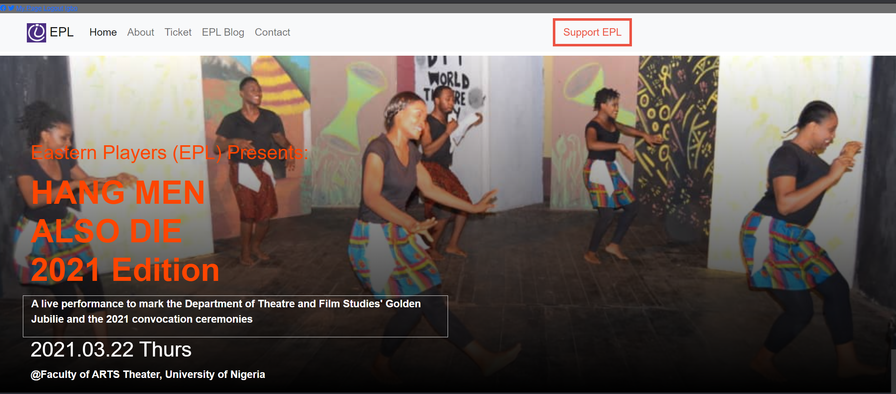
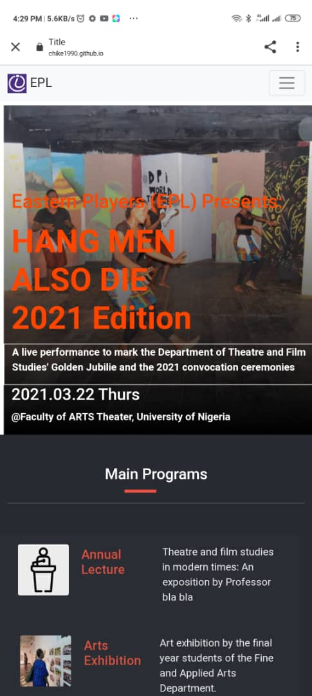
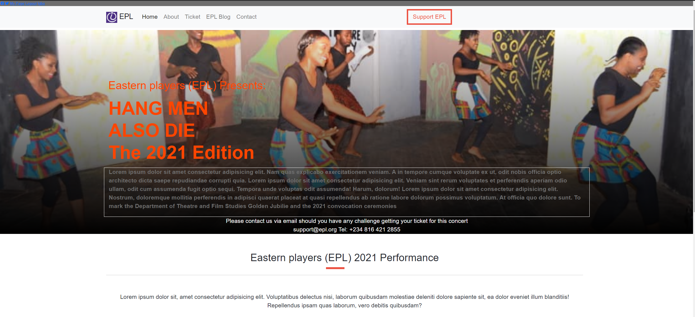
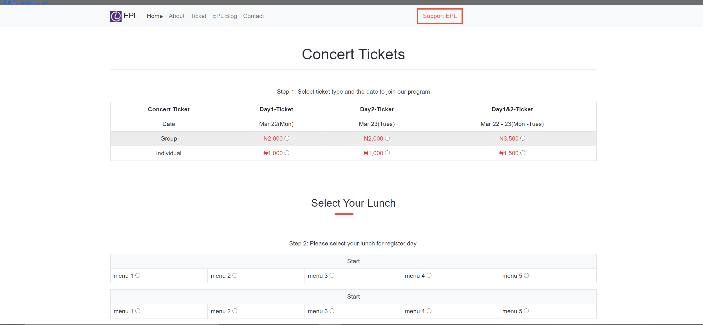

# Eastern Players Concert Ticket Website

###### Eastern Players Concert Ticket Website is my HTML & CSS 2.0 Capstone Project at Microverse. This project is a complete design on the Eastern Players Concert Tickets (Fictional). It follows a design prototype from Cindy Shin CC Global Summit 2015.

###### Complete design of the index, about, and ticket pages were designed using Grid, Flexbox, Bootstrap, alongside other CSS concepts covered in the HTML/CSS 2.0 module. Thus, I have used HTML 5 semantic tags, CSS styling, and bootstrap in this project.

Additional description about the project and its features.

## Built With

- HTML5 , CSS3, SASS
- Bootstrap
- Windows
- Font awesome icons

## Live Demo

[Live Demo Link](https://chike1990.github.io/mv_wk4_Eastern_Players_Concert_website/)

## Loom Video

[Click Here](https://www.loom.com/share/5b0645e4bda64a6091a15e2125083668)

## Getting Started

To get a local copy up and running follow these simple steps

- git clone (https://github.com/Chike1990/mv_wk4_Eastern_Players_Concert_website)
- cd Eastern_Players_Concert_website/
- git checkout -b development
- git pull
- If you have VScode Live Server installed, run it and open.

## Author

👤 **Chibuike Uzoechina**

- GitHub: [@chike](https://github.com/Chike1990)

## 🤝 Contributing

Contributions, issues, and feature requests are welcome!

Feel free to check the [issues page](https://github.com/Chike1990/mv_wk4_Eastern_Players_Concert_website/issues).

## Show your support

Give a ⭐️ if you like this project!

## Acknowledgments

- UI Design Credits goes to Cindy Shin - CC Global Summit 2015
- Project inspired by Microverse Program
- Motivation from my mentor, coding partners, stand up teams (who constantly reviewed and provided ideas and feedback during peer-to-peer code review section) and then the Students' Success team and TSEs.

## 📝 License

This project is [MIT](https://www.mit.edu/) licensed.
